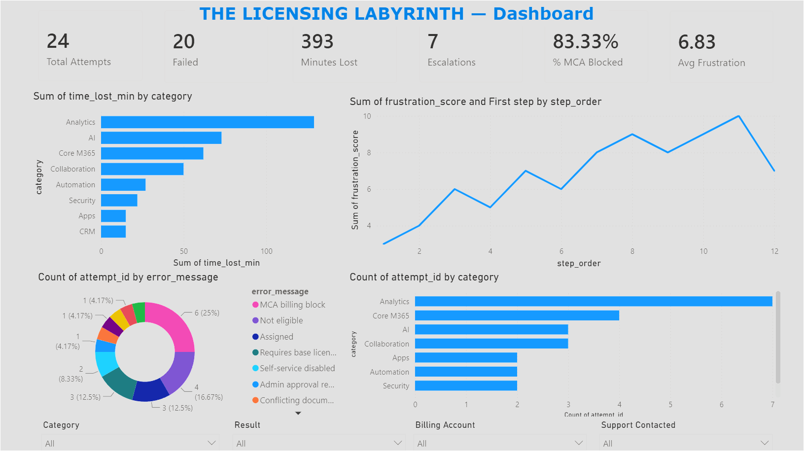
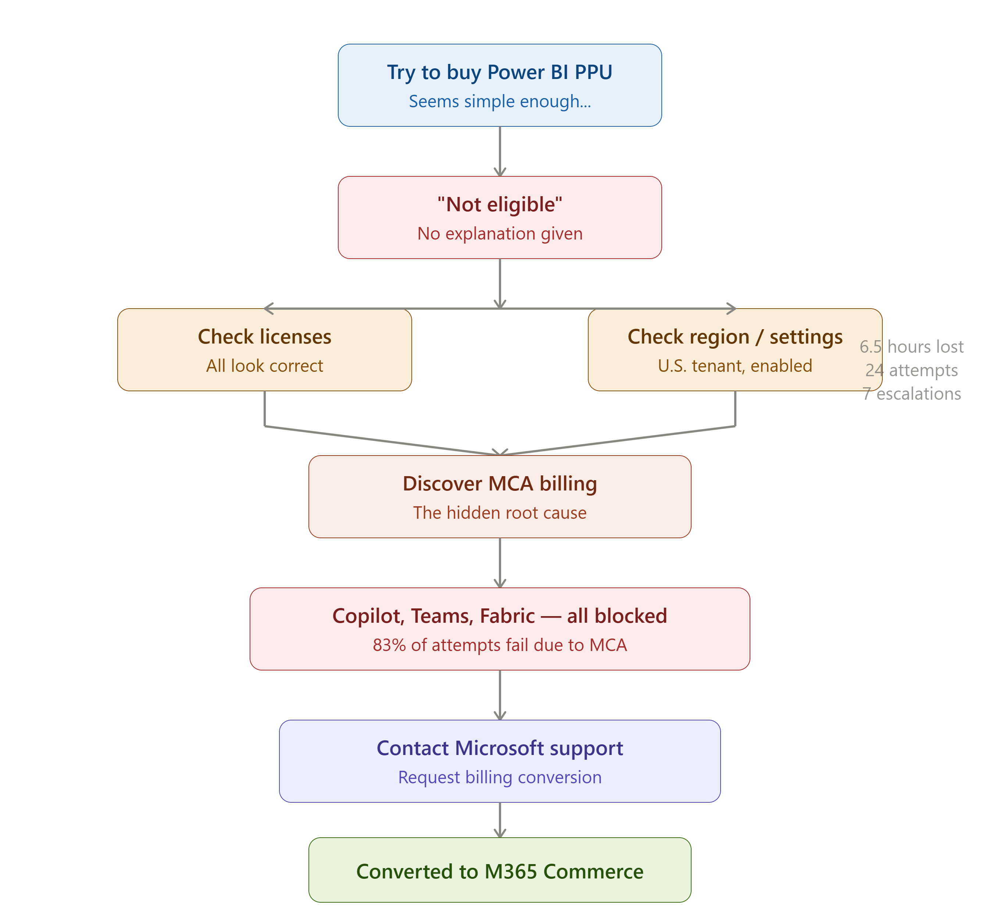
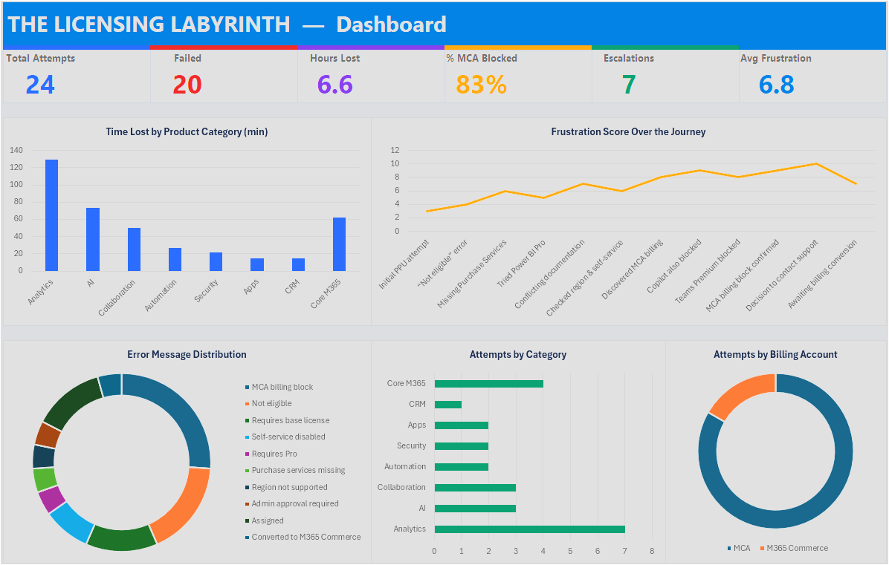

# 🏛️ The Licensing Labyrinth

### RLS//DATA | Ruben Santana

*A real-world data analytics case study built with Excel, SQL, Power BI, and Tableau.*

> "I just wanted to buy a Power BI license."
>
> "That's it."

---

## 🚀 Explore the Project

🌐 **Live Interactive Tableau Dashboard**  
https://public.tableau.com/app/profile/ruben.santana4478/viz/TheLicensingLabyrinth-MicrosoftLicensingCaseStudy/Story-LicensingJourney

📄 **Portfolio Report:** `reports/The_Licensing_Labyrinth_Portfolio.pdf`  
🗄 **SQL Scripts:** `sql/LicensingLabyrinth_Analytics.sql`  
📊 **Power BI File:** `powerbi/The_Licensing_Labyrinth_Dashboard.pbix`  
📈 **Tableau Workbook:** `tableau/Licensing_Labyrinth_Tableau_Final.twbx`

---

## 📊 Dashboard Preview



---

## 🚀 Project Highlights

- ✔ Real-world business problem
- ✔ Excel → SQL → Power BI → Tableau workflow
- ✔ Interactive dashboards
- ✔ Root-cause analysis
- ✔ Data storytelling
- ✔ Professional project documentation
- ✔ Cross-platform analytics case study

---

## 📖 What This Actually Is

I just wanted to buy a Power BI license.

That's it.

Instead, it turned into a multi-week licensing maze.

I had everything Microsoft said I needed:

- Microsoft 365 Business Standard
- Microsoft 365 Business Basic
- Admin permissions
- A U.S. tenant
- Self-service purchases enabled

...and I still couldn't purchase Power BI Premium Per User, Copilot, Teams Premium, Microsoft Fabric, or several other Microsoft add-ons.

Every attempt ended with some variation of **"Not eligible"** without any explanation.

It turns out the real problem wasn't permissions or licensing at all. It was a hidden billing mismatch between **MCA (Microsoft Customer Agreement)** and **Microsoft 365 Commerce**.

Nothing in the Microsoft Admin Center tells you this.

I didn't discover it by reading documentation.

I discovered it after **24 licensing attempts**, **7 support escalations**, and about **6.5 hours** of troubleshooting.

Instead of leaving it as a frustrating experience, I treated it like a data analytics project.

I logged every attempt, every error message, every minute lost, and every support interaction. Then I analyzed it with SQL, built KPI measures in Power BI using DAX, created an Excel dashboard prototype, and rebuilt the project again in Tableau.

This isn't a hypothetical dataset.

It's a real problem that happened to me, turned into a structured analytics case study.

---

## 🎯 The Problem

Despite meeting every documented prerequisite, I couldn't purchase Microsoft's enterprise add-ons.

The actual blocker was a billing mismatch between:

- MCA Billing
- Microsoft 365 Commerce Billing

The Microsoft Admin Center never explained this.

There wasn't a self-service fix.

The only resolution was having Microsoft Support manually convert the billing account.

---

## 📊 By the Numbers

| Metric | Value |
|---|---:|
| Total Licensing Attempts | 24 |
| Failed Attempts | 20 (83%) |
| Total Time Lost | 393 minutes (6.55 hrs) |
| Support Escalations | 7 |
| MCA Billing Block Rate | 83.33% |
| Average Frustration Score | 6.83 / 10 |
| Peak Frustration Score | 10 / 10 |

**Analytics products were hit the hardest**, accounting for **129 minutes lost across 7 attempts**, more than any other product category.

---

## 🛠 What I Built

### Structured Data Collection

I logged every licensing attempt, including:

- Product
- Category
- Result
- Error message
- Billing account
- Time lost
- Whether support was contacted

### SQL Analysis

Created analytics queries covering:

- Time lost
- Failure rates
- Error frequency
- Product categories
- Support escalation trends
- Root-cause analysis
- Ranking and window functions

### Excel Dashboard

Built an initial dashboard prototype featuring:

- KPI cards
- Charts
- Pivot-style analysis
- Formula-driven metrics

### Power BI Dashboard

Created an interactive dashboard featuring:

- 6 KPI cards
- 4 interactive charts
- 4 dynamic slicers
- DAX measures
- Cross-filtering

### Tableau Dashboard

Recreated the project in Tableau to demonstrate platform versatility and build an interactive visual story around the same dataset.

---

## 📈 Power BI Dashboard


---

## 🗺 Licensing Journey Flowchart



---

## 📊 Excel Prototype



---

## 🔍 Key Findings

### This wasn't user error.

I met every documented Microsoft requirement and still failed **83%** of the time.

### MCA billing accounts block enterprise add-ons.

Power BI Premium Per User, Copilot, Teams Premium, and Microsoft Fabric all became unavailable because of the billing system, not because of licensing eligibility.

### The Admin Center doesn't explain itself.

"Not eligible" is not an explanation.

There was no clear reason, no useful guidance, and no indication that billing was the real issue.

### Microsoft Support became the only path forward.

Seven out of twenty-four attempts ended in support escalation.

The final solution required Microsoft to manually convert the billing account.

### Frustration followed the data.

My frustration peaked at **10/10** right before giving up and contacting support.

Once the billing conversion started, it dropped to **7/10**.

Turns out frustration has a trend line too.

---

## 💡 If I Were Telling Microsoft What to Fix

- Unify MCA and Microsoft 365 Commerce billing
- Explain *why* purchases fail
- Add a self-service billing conversion option
- Display billing account type prominently inside the Admin Center
- Replace vague error messages with actionable guidance

---

## 👍 If You're Running Into This Yourself

Before spending hours troubleshooting:

- Check whether your tenant uses MCA or Microsoft 365 Commerce.
- Document every failed attempt and every error message.
- Contact Microsoft Support sooner rather than later.

I wish I had.

---

## ⚙️ Tools Used

| Tool | Purpose |
|---|---|
| Microsoft Excel | Data collection, cleaning, dashboard prototype |
| SQL | Root-cause analysis and analytics |
| Power BI | Interactive dashboards, DAX measures, and KPI development |
| Tableau | Interactive dashboard recreation and data storytelling |
| Python (Pandas & Matplotlib) | Supporting analysis and visualization |
| Visual Studio Code | SQL, Python, and Markdown development |
| GitHub | Portfolio presentation and project hosting |
| AI Assistance | Research, brainstorming, documentation, and development support |

---

## 🎓 Skills Demonstrated

- Data collection
- Data cleaning
- Exploratory data analysis
- SQL
- Window functions
- Dashboard design
- DAX
- Tableau
- Power BI
- Excel
- Data storytelling
- Root-cause analysis
- Business process analysis
- Technical documentation
- Problem solving

---

## 📁 Repository Structure

```text
README.md
data/
images/
powerbi/
reports/
sql/
tableau/
```

---

## 📌 Why This Is in My Portfolio

Because it's real.

I didn't invent a dataset or download one from Kaggle.

I lived through a genuinely broken process and turned it into something measurable.

This project demonstrates how I approach problems:

- Gather the data.
- Find the patterns.
- Build something useful.
- Tell the story clearly.

If I can take a frustrating real-world problem and turn it into something measurable and actionable, I can do the same with your data.

---

## Disclaimer

This is an independent portfolio project created for educational and demonstration purposes.

The data has been anonymized and structured as a case study.

Microsoft and related product names are trademarks of Microsoft Corporation.

This project is not affiliated with or endorsed by Microsoft.

---

## Contact

**Ruben Santana**  
**RLS//DATA**

*Turning real-world problems into data-driven solutions.*
