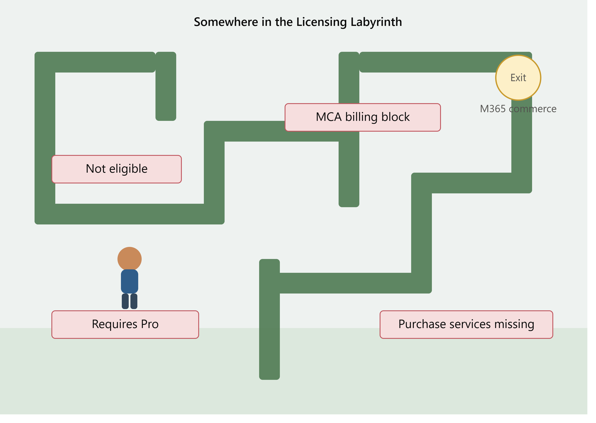
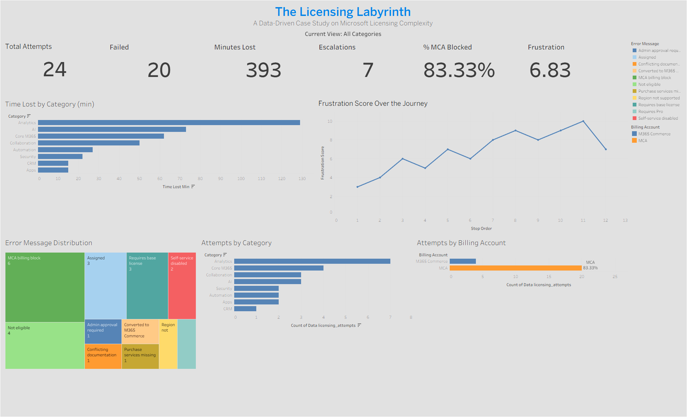
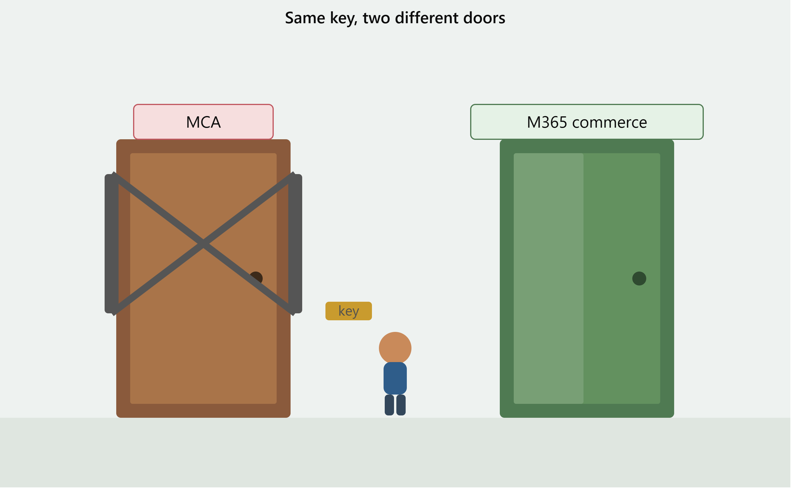
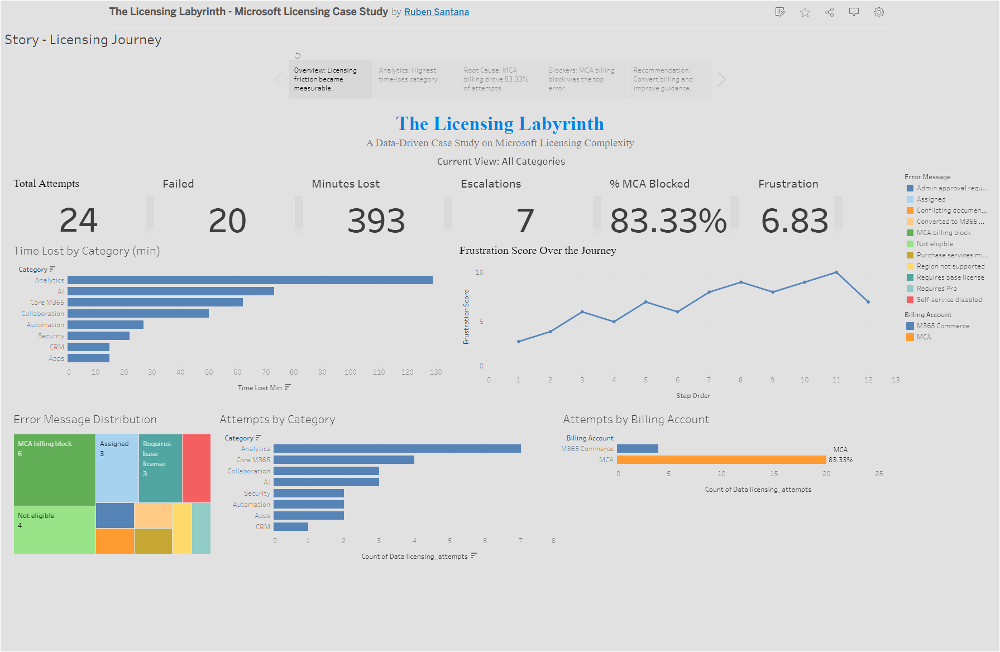
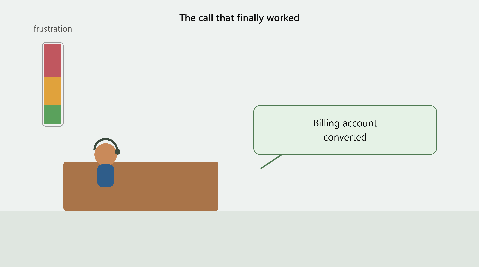

# 🏛️ The Licensing Labyrinth

### RLS//DATA | Ruben Santana

*A real-world data analytics case study built with Excel, SQL, Power BI, and Tableau.*

> **Built from a real problem.**  
> **Analyzed with data.**  
> **Presented with purpose.**

> "I just wanted to buy a Power BI license.  
> That's it."



---

## 📊 Final Tableau Dashboard



---

## 🔗 Explore the Project

🌐 **Live Interactive Tableau Dashboard**  
https://public.tableau.com/app/profile/ruben.santana4478/viz/TheLicensingLabyrinth-MicrosoftLicensingCaseStudy/Story-LicensingJourney

📄 **Portfolio Report:** `reports/The_Licensing_Labyrinth_Portfolio.pdf`  
🗄️ **SQL Scripts:** `sql/LicensingLabyrinth_Analytics.sql`  
📊 **Power BI File:** `powerbi/The_Licensing_Labyrinth_Dashboard.pbix`  
📈 **Tableau Workbook:** `tableau/Licensing_Labyrinth_Tableau_Final.twbx`  
📁 **Data Source:** `data/the_licensing_labyrinth.xlsx`

---

## 🚀 Project Highlights

- ✔ Real-world business problem turned into a data analytics case study
- ✔ Excel → SQL → Power BI → Tableau workflow
- ✔ Interactive Tableau dashboard published publicly
- ✔ Power BI dashboard with DAX measures and slicers
- ✔ SQL analysis for root-cause discovery
- ✔ Excel dashboard prototype and structured data model
- ✔ Complete portfolio documentation and repository organization

---

## 📖 What This Actually Is

I just wanted to buy a Power BI license.

That's it.

Instead, it turned into a multi-week licensing maze.

I had everything Microsoft said I needed:

- Microsoft 365 Business Standard
- Microsoft 365 Business Basic
- Admin permissions
- A U.S. tenant
- Self-service purchases enabled

...and I still couldn't purchase Power BI Premium Per User, Copilot, Teams Premium, Microsoft Fabric, or several other Microsoft add-ons.

Every attempt ended with some version of **"Not eligible"** with no real explanation.

It turns out the actual problem wasn't permissions or basic licensing. It was a hidden billing mismatch between **MCA (Microsoft Customer Agreement)** and **Microsoft 365 Commerce**.

Nothing in the Microsoft Admin Center made that obvious.



I didn't discover it by reading documentation.

I discovered it after **24 licensing attempts**, **7 support escalations**, and about **6.5 hours** of troubleshooting.

Instead of leaving it as a frustrating experience, I treated it like a data analytics project.

I logged every attempt, every error message, every minute lost, and every support interaction. Then I analyzed it with SQL, built KPI measures in Power BI using DAX, created an Excel dashboard prototype, and rebuilt the project again in Tableau.

This isn't a hypothetical dataset.

It's a real problem that happened to me, turned into a structured analytics case study.

---

## 🎯 The Problem

Despite meeting every documented prerequisite, I couldn't purchase Microsoft's enterprise add-ons.

The actual blocker was a billing mismatch between:

- **MCA Billing**
- **Microsoft 365 Commerce Billing**

The Microsoft Admin Center never explained this clearly.

There wasn't a self-service fix.

The only resolution was having Microsoft Support manually convert the billing account.

---

## 📊 By the Numbers

| Metric | Value |
|---|---:|
| Total Licensing Attempts | 24 |
| Failed Attempts | 20 (83%) |
| Total Time Lost | 393 minutes (6.55 hrs) |
| Support Escalations | 7 |
| MCA Billing Block Rate | 83.33% |
| Average Frustration Score | 6.83 / 10 |
| Peak Frustration Score | 10 / 10 |

**Analytics products were hit the hardest**, accounting for **129 minutes lost across 7 attempts**, more than any other product category.

---

## 🛠️ What I Built

### Structured Data Collection

I logged every licensing attempt, including:

- Product
- Category
- Result
- Error message
- Billing account type
- Time lost
- Support contacted

### SQL Analysis

I created analytics queries covering:

- Time lost
- Failure rates
- Error frequency
- Product categories
- Support escalation patterns
- Root-cause analysis
- Ranking and window functions

### Excel Dashboard Prototype

The first dashboard version was built in Excel using structured tables, formulas, KPIs, and embedded charts.

### Power BI Dashboard

The Power BI version included KPI cards, slicers, DAX measures, and cross-filtering.

### Tableau Dashboard

The final Tableau version was published publicly as an interactive dashboard and story walkthrough.

---

## 🧭 Interactive Tableau Story



The Tableau story walks through the licensing journey step by step, moving from the overview to analytics, root cause, blockers, and recommendations.

---

## 🖥️ Power BI Dashboard


The Power BI dashboard was used to develop interactive KPI views, category analysis, frustration tracking, and DAX-based measures before rebuilding the project in Tableau.

---

## 📈 Excel Prototype


The Excel workbook served as the prototype layer for organizing the data, testing calculations, and sketching early dashboard ideas.

---

## 🗺️ Licensing Journey Flowchart


The flowchart maps the full troubleshooting path from the first failed purchase attempt through support escalation and billing conversion.

---

## 🔍 What I Found

### This wasn't user error.

I met every documented requirement and still failed **83%** of the time.

### MCA billing accounts block enterprise add-ons.

Power BI Premium Per User, Copilot, Teams Premium, and Microsoft Fabric were all unavailable because of the billing system, not because of user eligibility.

### The Admin Center doesn't explain itself.

"Not eligible" is not an explanation.

There was no clear reason, no guided path, and no obvious indication that billing was the real issue.

### Support became the only path forward.

Seven out of twenty-four attempts ended in support escalation.

The final solution required Microsoft to manually convert the billing account.

### Frustration followed the data.

My frustration peaked at **10/10** right before giving up and contacting support.

Once the billing conversion finally began, it dropped to **7/10**.

Turns out frustration has a trend line too.



---

## 💡 If I Were Telling Microsoft What to Fix

- Unify MCA and Microsoft 365 Commerce billing
- Explain *why* purchases fail
- Add a self-service billing conversion option
- Display billing account type clearly in the Admin Center
- Replace vague error messages with actionable guidance

---

## 👍 If You're Running Into This Yourself

Before spending hours troubleshooting:

- Check whether your tenant uses MCA or Microsoft 365 Commerce.
- Document every failed attempt and error message.
- Contact Microsoft Support sooner rather than later.

I wish I had.

---

## ⚙️ Tools Used

| Tool | Purpose |
|---|---|
| Microsoft Excel | Data collection, cleaning, and dashboard prototype |
| SQL | Root-cause analysis and analytics queries |
| Power BI | Interactive dashboard, DAX measures, and KPI development |
| Tableau | Final interactive dashboard and public story walkthrough |
| Python (Pandas & Matplotlib) | Supporting analysis and visualization |
| Visual Studio Code | SQL, Python, and Markdown development |
| GitHub | Portfolio presentation and project hosting |
| AI Assistance | Research, brainstorming, documentation, and development support |

---

## 🎓 Skills Demonstrated

- Data collection
- Data cleaning
- Exploratory data analysis
- SQL querying
- Window functions
- KPI development
- DAX measures
- Dashboard design
- Tableau storytelling
- Power BI reporting
- Excel prototyping
- Root-cause analysis
- Business process analysis
- Technical documentation
- Data storytelling
- Problem solving

---

## 📁 Repository Structure

```text
the-licensing-labyrinth/
│
├── README.md
│
├── data/
│   └── the_licensing_labyrinth.xlsx
│
├── images/
│   ├── tableau_dashboard_final.png
│   ├── tableau_story_final.png
│   ├── The_Licensing_Labyrinth_Dashboard.png
│   ├── The_Licensing_Labyrinth_Excel_Shot.png
│   └── licensing_labyrinth_journey_flowchart.png
│
├── powerbi/
│   └── The_Licensing_Labyrinth_Dashboard.pbix
│
├── reports/
│   └── The_Licensing_Labyrinth_Portfolio.pdf
│
├── sql/
│   ├── LicensingLabyrinth_Analytics.sql
│   └── LicensingLabyrinth_Analytics_2.sql
│
└── tableau/
    └── Licensing_Labyrinth_Tableau_Final.twbx
```

---

## 📌 Why This Is in My Portfolio

Because it's real.

I didn't invent a dataset or download one from Kaggle.

I lived through a genuinely broken process and turned it into something measurable.

This project demonstrates how I approach problems:

- Gather the data.
- Find the patterns.
- Build something useful.
- Tell the story clearly.

If I can take a frustrating real-world problem and turn it into something measurable and actionable, I can do the same with your data.

---

## 🧠 Lessons Learned

This project reminded me that data analytics is not just about charts.

It's about noticing when something is broken, collecting evidence, finding patterns, and explaining the issue clearly enough that someone else can understand it.

The tools matter, but the thinking matters more.

---

## 👤 About the Author

**Ruben Santana**  
**RLS//DATA**

Aspiring data analyst building real-world portfolio projects with Excel, SQL, Power BI, Tableau, and data storytelling.

> *Learning by building — one project at a time.*

---

## Disclaimer

This is an independent portfolio project created for educational and demonstration purposes.

The data has been anonymized and structured as a case study.

Microsoft and related product names are trademarks of Microsoft Corporation.

This project is not affiliated with or endorsed by Microsoft.

---

## Contact

**Ruben Santana**  
**RLS//DATA**  
*Turning real-world problems into data-driven solutions.*
